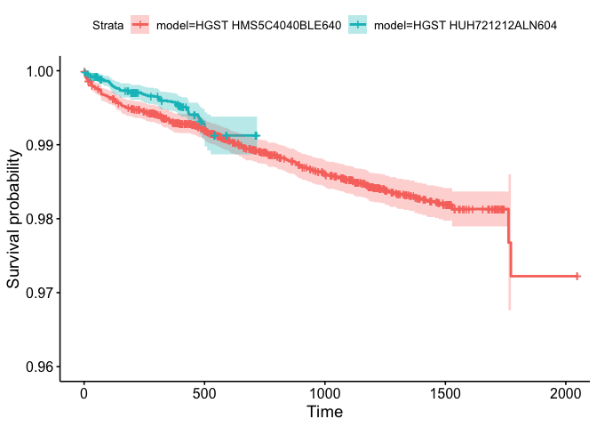
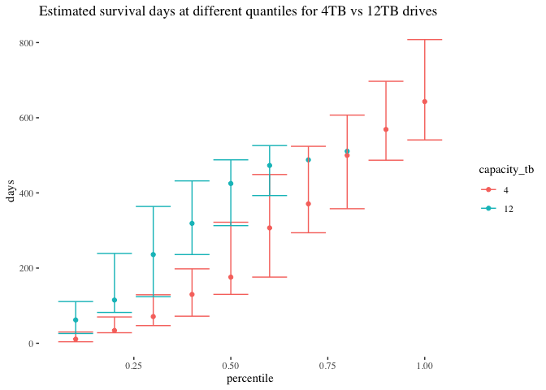

Data Sources
============

I’m buying a hard drive to backup my data at home, and I want to buy a
drive that’s not going to fail. Fortunately, [BackBlaze has shared all
of their data on hard drives and drive
failures.](https://www.backblaze.com/b2/hard-drive-test-data.html#downloading-the-raw-hard-drive-test-data)

Backblaze [did their own
analysis](https://www.backblaze.com/blog/backblaze-hard-drive-stats-q1-2020/)
of drive failures, but I don’t like their approach for 2 reasons:  
1. Their “annualized failure rate”
(`Drive Failures / (Drive Days / 365)`) assumes that failure rates are
constant over time. E.g. this assumption means that observing 1 drive
for 100 days gives you the exact same information as observing 100
drives for 1 day.  
2. They don’t really explain how they derived confidence intervals or
used them in their analysis, and pretty much rely on the “annualized
failure rate” to make conclusions. I want to use a confidence interval
for my decision making. For a lot more detail on why a confidence
interval is a good idea, read Evan Miller’s blog post about a different
type of problem: [How Not To Sort By Average
Rating](https://www.evanmiller.org/how-not-to-sort-by-average-rating.html).

I wanted to use a failure model that allows for time-varying failure
rates, and then pick a drive based on a confidence interval, so here we
are.

Survival Analysis
=================

I wanted to pick my drive based on:
`lower 95% confidence interval for median time to failure`. In other
words, I want to pick the drive model that has the most evidence it will
last a large number of days.

In order to analyze median time to failure, you need to observe your
sample long enough for 50% of the drives to fail. However, these drives
are **so reliable** that almost none of the models in the sample have
yet hit the 50% failure mark. Therefore, I will settle for looking at
`upper 95% confidence interval for failure rate after 1 year`. In other
words, I want to pick the drive I am most sure will last at least one
year.

Some technical notes:  
1. I only looked at drive models where at least 100 individual drives
lasted a year or longer, to remove drive models without a lot of data.
(I don’t love this, and wish I knew how to make the survival curve
confidence intervals reflect uncertainty from the number of individuals
observed).  
2. This analysis does not assume a constant failure rate for each drive
model. We often see in real life that drives fail at a high rate early
on, and then failures become less likely over time.  
3. This analysis allows different drive models to have different failure
“curves.” I looped over every drive model, ran the
[survfit](https://www.rdocumentation.org/packages/survival/versions/2.11-4/topics/survfit)
function in R (which fits a very simple, non-parametric [Kaplan-Meier
survival
curve](https://en.wikipedia.org/wiki/Kaplan%E2%80%93Meier_estimator)),
and then took the 95% confidence interval at 1 year from the fitted
survival curve.

Here’s the results of our analysis. The HGST HUH721212ALN604 is the most
reliable drive model in our sample of data:

<table>
<thead>
<tr class="header">
<th style="text-align: left;">model</th>
<th style="text-align: right;">capacity_tb</th>
<th style="text-align: right;">drive_days</th>
<th style="text-align: right;">failures</th>
<th style="text-align: left;">one_year_failure_rate</th>
<th style="text-align: left;">ci_95</th>
</tr>
</thead>
<tbody>
<tr class="odd">
<td style="text-align: left;">HGST HUH721212ALN604</td>
<td style="text-align: right;">12.0</td>
<td style="text-align: right;">4893547</td>
<td style="text-align: right;">65</td>
<td style="text-align: left;">0.42%</td>
<td style="text-align: left;">0.55%</td>
</tr>
<tr class="even">
<td style="text-align: left;">HGST HUH721212ALE600</td>
<td style="text-align: right;">12.0</td>
<td style="text-align: right;">669202</td>
<td style="text-align: right;">8</td>
<td style="text-align: left;">0.40%</td>
<td style="text-align: left;">0.69%</td>
</tr>
<tr class="odd">
<td style="text-align: left;">ST10000NM0086</td>
<td style="text-align: right;">10.0</td>
<td style="text-align: right;">1222596</td>
<td style="text-align: right;">25</td>
<td style="text-align: left;">0.40%</td>
<td style="text-align: left;">0.76%</td>
</tr>
<tr class="even">
<td style="text-align: left;">HGST HMS5C4040BLE640</td>
<td style="text-align: right;">4.0</td>
<td style="text-align: right;">21867106</td>
<td style="text-align: right;">274</td>
<td style="text-align: left;">0.68%</td>
<td style="text-align: left;">0.81%</td>
</tr>
<tr class="odd">
<td style="text-align: left;">Hitachi HDS5C3030ALA630</td>
<td style="text-align: right;">3.0</td>
<td style="text-align: right;">6641559</td>
<td style="text-align: right;">150</td>
<td style="text-align: left;">0.77%</td>
<td style="text-align: left;">1.02%</td>
</tr>
<tr class="even">
<td style="text-align: left;">TOSHIBA MG07ACA14TA</td>
<td style="text-align: right;">14.0</td>
<td style="text-align: right;">1797240</td>
<td style="text-align: right;">54</td>
<td style="text-align: left;">0.85%</td>
<td style="text-align: left;">1.17%</td>
</tr>
<tr class="odd">
<td style="text-align: left;">HGST HMS5C4040ALE640</td>
<td style="text-align: right;">4.0</td>
<td style="text-align: right;">12187880</td>
<td style="text-align: right;">179</td>
<td style="text-align: left;">0.99%</td>
<td style="text-align: left;">1.19%</td>
</tr>
<tr class="even">
<td style="text-align: left;">ST8000NM0055</td>
<td style="text-align: right;">8.0</td>
<td style="text-align: right;">15779767</td>
<td style="text-align: right;">516</td>
<td style="text-align: left;">1.07%</td>
<td style="text-align: left;">1.23%</td>
</tr>
<tr class="odd">
<td style="text-align: left;">HGST HUH728080ALE600</td>
<td style="text-align: right;">8.0</td>
<td style="text-align: right;">977265</td>
<td style="text-align: right;">17</td>
<td style="text-align: left;">0.75%</td>
<td style="text-align: left;">1.27%</td>
</tr>
<tr class="even">
<td style="text-align: left;">ST8000DM002</td>
<td style="text-align: right;">8.0</td>
<td style="text-align: right;">13572615</td>
<td style="text-align: right;">392</td>
<td style="text-align: left;">1.09%</td>
<td style="text-align: left;">1.29%</td>
</tr>
<tr class="odd">
<td style="text-align: left;">Hitachi HDS722020ALA330</td>
<td style="text-align: right;">2.0</td>
<td style="text-align: right;">5306511</td>
<td style="text-align: right;">235</td>
<td style="text-align: left;">1.09%</td>
<td style="text-align: left;">1.39%</td>
</tr>
<tr class="even">
<td style="text-align: left;">ST500LM012 HN</td>
<td style="text-align: right;">0.5</td>
<td style="text-align: right;">1161496</td>
<td style="text-align: right;">148</td>
<td style="text-align: left;">1.00%</td>
<td style="text-align: left;">1.68%</td>
</tr>
<tr class="odd">
<td style="text-align: left;">ST12000NM0007</td>
<td style="text-align: right;">12.0</td>
<td style="text-align: right;">27502834</td>
<td style="text-align: right;">1675</td>
<td style="text-align: left;">1.57%</td>
<td style="text-align: left;">1.69%</td>
</tr>
<tr class="even">
<td style="text-align: left;">WDC WD5000LPVX</td>
<td style="text-align: right;">0.5</td>
<td style="text-align: right;">568740</td>
<td style="text-align: right;">69</td>
<td style="text-align: left;">0.86%</td>
<td style="text-align: left;">1.82%</td>
</tr>
<tr class="odd">
<td style="text-align: left;">Hitachi HDS5C4040ALE630</td>
<td style="text-align: right;">4.0</td>
<td style="text-align: right;">4401851</td>
<td style="text-align: right;">88</td>
<td style="text-align: left;">1.40%</td>
<td style="text-align: left;">1.84%</td>
</tr>
<tr class="even">
<td style="text-align: left;">Hitachi HDS723030ALA640</td>
<td style="text-align: right;">3.0</td>
<td style="text-align: right;">1429666</td>
<td style="text-align: right;">73</td>
<td style="text-align: left;">1.34%</td>
<td style="text-align: left;">2.03%</td>
</tr>
<tr class="odd">
<td style="text-align: left;">ST6000DX000</td>
<td style="text-align: right;">6.0</td>
<td style="text-align: right;">3058616</td>
<td style="text-align: right;">87</td>
<td style="text-align: left;">1.50%</td>
<td style="text-align: left;">2.03%</td>
</tr>
<tr class="even">
<td style="text-align: left;">ST4000DX000</td>
<td style="text-align: right;">4.0</td>
<td style="text-align: right;">293560</td>
<td style="text-align: right;">81</td>
<td style="text-align: left;">0.90%</td>
<td style="text-align: left;">2.14%</td>
</tr>
<tr class="odd">
<td style="text-align: left;">ST4000DM000</td>
<td style="text-align: right;">4.0</td>
<td style="text-align: right;">56007808</td>
<td style="text-align: right;">3969</td>
<td style="text-align: left;">2.37%</td>
<td style="text-align: left;">2.53%</td>
</tr>
<tr class="even">
<td style="text-align: left;">TOSHIBA MD04ABA400V</td>
<td style="text-align: right;">4.0</td>
<td style="text-align: right;">252425</td>
<td style="text-align: right;">5</td>
<td style="text-align: left;">2.00%</td>
<td style="text-align: left;">4.22%</td>
</tr>
<tr class="odd">
<td style="text-align: left;">TOSHIBA MQ01ABF050M</td>
<td style="text-align: right;">0.5</td>
<td style="text-align: right;">342176</td>
<td style="text-align: right;">43</td>
<td style="text-align: left;">2.79%</td>
<td style="text-align: left;">4.34%</td>
</tr>
<tr class="even">
<td style="text-align: left;">TOSHIBA MQ01ABF050</td>
<td style="text-align: right;">0.5</td>
<td style="text-align: right;">559663</td>
<td style="text-align: right;">195</td>
<td style="text-align: left;">4.62%</td>
<td style="text-align: left;">6.30%</td>
</tr>
<tr class="odd">
<td style="text-align: left;">WDC WD10EADS</td>
<td style="text-align: right;">1.0</td>
<td style="text-align: right;">370505</td>
<td style="text-align: right;">64</td>
<td style="text-align: left;">4.57%</td>
<td style="text-align: left;">6.31%</td>
</tr>
<tr class="even">
<td style="text-align: left;">WDC WD1600AAJS</td>
<td style="text-align: right;">0.2</td>
<td style="text-align: right;">126941</td>
<td style="text-align: right;">20</td>
<td style="text-align: left;">3.25%</td>
<td style="text-align: left;">6.34%</td>
</tr>
<tr class="odd">
<td style="text-align: left;">HGST HDS5C4040ALE630</td>
<td style="text-align: right;">4.0</td>
<td style="text-align: right;">112400</td>
<td style="text-align: right;">6</td>
<td style="text-align: left;">3.44%</td>
<td style="text-align: left;">6.70%</td>
</tr>
<tr class="even">
<td style="text-align: left;">WDC WD60EFRX</td>
<td style="text-align: right;">6.0</td>
<td style="text-align: right;">685610</td>
<td style="text-align: right;">72</td>
<td style="text-align: left;">5.41%</td>
<td style="text-align: left;">7.38%</td>
</tr>
<tr class="odd">
<td style="text-align: left;">WDC WD30EFRX</td>
<td style="text-align: right;">3.0</td>
<td style="text-align: right;">1271769</td>
<td style="text-align: right;">174</td>
<td style="text-align: left;">7.71%</td>
<td style="text-align: left;">9.16%</td>
</tr>
<tr class="even">
<td style="text-align: left;">ST33000651AS</td>
<td style="text-align: right;">3.0</td>
<td style="text-align: right;">222587</td>
<td style="text-align: right;">31</td>
<td style="text-align: left;">6.60%</td>
<td style="text-align: left;">9.29%</td>
</tr>
<tr class="odd">
<td style="text-align: left;">WDC WD20EFRX</td>
<td style="text-align: right;">2.0</td>
<td style="text-align: right;">67422</td>
<td style="text-align: right;">15</td>
<td style="text-align: left;">5.90%</td>
<td style="text-align: left;">9.59%</td>
</tr>
<tr class="even">
<td style="text-align: left;">ST32000542AS</td>
<td style="text-align: right;">2.0</td>
<td style="text-align: right;">119309</td>
<td style="text-align: right;">33</td>
<td style="text-align: left;">7.42%</td>
<td style="text-align: left;">10.35%</td>
</tr>
<tr class="odd">
<td style="text-align: left;">ST31500541AS</td>
<td style="text-align: right;">1.5</td>
<td style="text-align: right;">1445217</td>
<td style="text-align: right;">397</td>
<td style="text-align: left;">9.74%</td>
<td style="text-align: left;">11.00%</td>
</tr>
<tr class="even">
<td style="text-align: left;">ST500LM030</td>
<td style="text-align: right;">0.5</td>
<td style="text-align: right;">129711</td>
<td style="text-align: right;">44</td>
<td style="text-align: left;">11.18%</td>
<td style="text-align: left;">14.88%</td>
</tr>
<tr class="odd">
<td style="text-align: left;">ST3000DM001</td>
<td style="text-align: right;">3.0</td>
<td style="text-align: right;">2205148</td>
<td style="text-align: right;">1708</td>
<td style="text-align: left;">15.13%</td>
<td style="text-align: left;">16.17%</td>
</tr>
<tr class="even">
<td style="text-align: left;">ST31500341AS</td>
<td style="text-align: right;">1.5</td>
<td style="text-align: right;">330431</td>
<td style="text-align: right;">216</td>
<td style="text-align: left;">21.07%</td>
<td style="text-align: left;">24.19%</td>
</tr>
</tbody>
</table>

12TB vs 4TB drives
==================

Lets drill down into my results a little bit, and compare our best 12TB
drive (HGST HUH721212ALN604) to the best 4TB drive (HGST
HMS5C4040BLE640):

<table>
<thead>
<tr class="header">
<th style="text-align: left;">model</th>
<th style="text-align: right;">capacity_tb</th>
<th style="text-align: right;">drive_days</th>
<th style="text-align: right;">failures</th>
<th style="text-align: right;">N_drives</th>
<th style="text-align: left;">one_year_failure_rate</th>
<th style="text-align: left;">ci_95</th>
</tr>
</thead>
<tbody>
<tr class="odd">
<td style="text-align: left;">HGST HUH721212ALN604</td>
<td style="text-align: right;">12</td>
<td style="text-align: right;">4893547</td>
<td style="text-align: right;">65</td>
<td style="text-align: right;">10914</td>
<td style="text-align: left;">0.42%</td>
<td style="text-align: left;">0.55%</td>
</tr>
<tr class="even">
<td style="text-align: left;">HGST HMS5C4040BLE640</td>
<td style="text-align: right;">4</td>
<td style="text-align: right;">21867106</td>
<td style="text-align: right;">274</td>
<td style="text-align: right;">16346</td>
<td style="text-align: left;">0.68%</td>
<td style="text-align: left;">0.81%</td>
</tr>
</tbody>
</table>

Let’s use Backblaze’s “naive” statistic to compare these 2 drives:
`Drive Failures / (Drive Days / 365)`

<table>
<thead>
<tr class="header">
<th style="text-align: left;">model</th>
<th style="text-align: right;">capacity_tb</th>
<th style="text-align: right;">drive_days</th>
<th style="text-align: left;">one_year_failure_rate</th>
<th style="text-align: left;">naive_rate</th>
</tr>
</thead>
<tbody>
<tr class="odd">
<td style="text-align: left;">HGST HUH721212ALN604</td>
<td style="text-align: right;">12</td>
<td style="text-align: right;">4893547</td>
<td style="text-align: left;">0.42%</td>
<td style="text-align: left;">0.48%</td>
</tr>
<tr class="even">
<td style="text-align: left;">HGST HMS5C4040BLE640</td>
<td style="text-align: right;">4</td>
<td style="text-align: right;">21867106</td>
<td style="text-align: left;">0.68%</td>
<td style="text-align: left;">0.46%</td>
</tr>
</tbody>
</table>

The HGST HUH721212ALN604 actually has a **higher** naive failure rate at
0.48% than the HGST HMS5C4040BLE640 at 0.46%.

So why do I reccomend buying HGST HMS5C4040BLE640?

The answer is that we’ve observed the HGST HMS5C4040BLE640 for many more
years than the HGST HUH721212ALN604. On the one had, these extra years
give us more certainty that these drives are reliable and fail at
extremely low rates. On the other hand, these extra years are **late**
in the drive’s lifetimes, when failure rates are (expected) to be lower.

Zooming in on the first year of a drive’s life demonstates that the
0.48% has a lower failure rate during this period. Obviously the future
beyond that is unknown, but I expect this lower failure rate to continue
over the lifetime of the two drives:

Replicating my results
======================

[all\_data.csv](all_data.csv) has the cleaned up data from backblaze, at
the level of individual drives, days observed, and whether or not the
drive failed.

[README.Rmd](README.Rmd) has the code to run this analysis and generate
this [README.md](README.md) file you are reading right now. Use
[RStudio](https://rstudio.com/products/rstudio/download/) to `knit` the
`Rmd` file into a `md` file, which github will then render nicely for
you.
[knitr::kable](https://www.rdocumentation.org/packages/knitr/versions/1.29/topics/kable)
produces the nice table of results.

If you want to get the raw data before it was cleaned up into
[all\_data.csv](all_data.csv), you’ll need at least 70GB of free hard
drive space. I also suggest opening
[backblaze\_analysis.Rproj](backblaze_analysis.Rproj) in RStudio.  
1. Run [1\_download\_data.R](1_download_data.R) to download the data
(almost 10.5 GB).  
2. Run [2\_unzip\_data.R](2_unzip_data.R) to unzip the data (almost 55
GB).  
3. Run [3\_assemble\_data.R](3_assemble_data.R) to “compress” the data,
which generates [all\_data.csv](all_data.csv).

An interesting note about this data: It’s 55GB uncompressed, and
contains a whole bunch of irrelevant informtation. It was very
interesting to me that I could compress a 55GB dataset to 10mb, while
still keeping **all** of the relevant information for modeling. (In
other words, this dataset was 5,000x larger than it needed to be). I
think this is another example of how “good data structures” are
essential for effective engineering, and data science is, at its core,
engineering.

Some notes on survival analysis
===============================

Survival analysis is a little weird, becuase you don’t observe the full
distribution of your data. This makes some traditional statistics
impossible to calculate.

For example, until you observe every hard drive in the sample fail, you
can’t know the mean failure rate. (For example if you have one unit left
that hasn’t failed yet, and becomes an outlier in survival time, that
might have a big impact on mean survivial time.)

Therefore, for most survival problems, we use quantiles. For example,
once you’ve observed 50% of the hard drives fail, you can compute median
time to failure. Or perhaps once you’ve observed 10% of the drives fail,
you can calculate the 10th percentile of time to failure.

Here’s the thing: these drivew are **so reliable** even after 5 years of
data, we’ve barely observed the distribution of failures. (This is a
good thing, but it makes it hard to chose between drives!).

Here’s our best 12TB and 4TB drives:

<table>
<thead>
<tr class="header">
<th style="text-align: left;">model</th>
<th style="text-align: right;">capacity_tb</th>
<th style="text-align: right;">failures</th>
<th style="text-align: right;">N_drives</th>
<th style="text-align: left;">pct_failed</th>
</tr>
</thead>
<tbody>
<tr class="odd">
<td style="text-align: left;">HGST HUH721212ALN604</td>
<td style="text-align: right;">12</td>
<td style="text-align: right;">65</td>
<td style="text-align: right;">10914</td>
<td style="text-align: left;">0.60%</td>
</tr>
<tr class="even">
<td style="text-align: left;">HGST HMS5C4040BLE640</td>
<td style="text-align: right;">4</td>
<td style="text-align: right;">274</td>
<td style="text-align: right;">16346</td>
<td style="text-align: left;">1.68%</td>
</tr>
</tbody>
</table>

So at most, we’ve seen 1.68% drives fail, which means we’re at most
seeing the 1.68% percentile for drive survival time— we cannot make any
inferences about percentiles higher than this, becuase **not enough
drives have failed yet!**. Interestingly, we can start to estimate a
lower bound on survival time at a given quantile as we get close to it.

So, here is a survival table for the known quantiles for these 2 drives,
along with upper and lower bounds on the estimated time-to-survival for
that quantile:

<table>
<thead>
<tr class="header">
<th style="text-align: left;">model</th>
<th style="text-align: right;">capacity_tb</th>
<th style="text-align: right;">percentile</th>
<th style="text-align: right;">lower</th>
<th style="text-align: right;">days</th>
<th style="text-align: right;">upper</th>
</tr>
</thead>
<tbody>
<tr class="odd">
<td style="text-align: left;">HGST HMS5C4040BLE640</td>
<td style="text-align: right;">4</td>
<td style="text-align: right;">0.1</td>
<td style="text-align: right;">4</td>
<td style="text-align: right;">11</td>
<td style="text-align: right;">30</td>
</tr>
<tr class="even">
<td style="text-align: left;">HGST HMS5C4040BLE640</td>
<td style="text-align: right;">4</td>
<td style="text-align: right;">0.2</td>
<td style="text-align: right;">28</td>
<td style="text-align: right;">34</td>
<td style="text-align: right;">70</td>
</tr>
<tr class="odd">
<td style="text-align: left;">HGST HMS5C4040BLE640</td>
<td style="text-align: right;">4</td>
<td style="text-align: right;">0.3</td>
<td style="text-align: right;">47</td>
<td style="text-align: right;">71</td>
<td style="text-align: right;">129</td>
</tr>
<tr class="even">
<td style="text-align: left;">HGST HMS5C4040BLE640</td>
<td style="text-align: right;">4</td>
<td style="text-align: right;">0.4</td>
<td style="text-align: right;">72</td>
<td style="text-align: right;">130</td>
<td style="text-align: right;">198</td>
</tr>
<tr class="odd">
<td style="text-align: left;">HGST HMS5C4040BLE640</td>
<td style="text-align: right;">4</td>
<td style="text-align: right;">0.5</td>
<td style="text-align: right;">130</td>
<td style="text-align: right;">176</td>
<td style="text-align: right;">322</td>
</tr>
<tr class="even">
<td style="text-align: left;">HGST HMS5C4040BLE640</td>
<td style="text-align: right;">4</td>
<td style="text-align: right;">0.6</td>
<td style="text-align: right;">176</td>
<td style="text-align: right;">307</td>
<td style="text-align: right;">449</td>
</tr>
<tr class="odd">
<td style="text-align: left;">HGST HMS5C4040BLE640</td>
<td style="text-align: right;">4</td>
<td style="text-align: right;">0.7</td>
<td style="text-align: right;">294</td>
<td style="text-align: right;">371</td>
<td style="text-align: right;">524</td>
</tr>
<tr class="even">
<td style="text-align: left;">HGST HMS5C4040BLE640</td>
<td style="text-align: right;">4</td>
<td style="text-align: right;">0.8</td>
<td style="text-align: right;">358</td>
<td style="text-align: right;">500</td>
<td style="text-align: right;">607</td>
</tr>
<tr class="odd">
<td style="text-align: left;">HGST HMS5C4040BLE640</td>
<td style="text-align: right;">4</td>
<td style="text-align: right;">0.9</td>
<td style="text-align: right;">487</td>
<td style="text-align: right;">569</td>
<td style="text-align: right;">697</td>
</tr>
<tr class="even">
<td style="text-align: left;">HGST HMS5C4040BLE640</td>
<td style="text-align: right;">4</td>
<td style="text-align: right;">1.0</td>
<td style="text-align: right;">541</td>
<td style="text-align: right;">643</td>
<td style="text-align: right;">808</td>
</tr>
<tr class="odd">
<td style="text-align: left;">HGST HUH721212ALN604</td>
<td style="text-align: right;">12</td>
<td style="text-align: right;">0.1</td>
<td style="text-align: right;">26</td>
<td style="text-align: right;">62</td>
<td style="text-align: right;">111</td>
</tr>
<tr class="even">
<td style="text-align: left;">HGST HUH721212ALN604</td>
<td style="text-align: right;">12</td>
<td style="text-align: right;">0.2</td>
<td style="text-align: right;">82</td>
<td style="text-align: right;">115</td>
<td style="text-align: right;">239</td>
</tr>
<tr class="odd">
<td style="text-align: left;">HGST HUH721212ALN604</td>
<td style="text-align: right;">12</td>
<td style="text-align: right;">0.3</td>
<td style="text-align: right;">124</td>
<td style="text-align: right;">236</td>
<td style="text-align: right;">364</td>
</tr>
<tr class="even">
<td style="text-align: left;">HGST HUH721212ALN604</td>
<td style="text-align: right;">12</td>
<td style="text-align: right;">0.4</td>
<td style="text-align: right;">236</td>
<td style="text-align: right;">319</td>
<td style="text-align: right;">432</td>
</tr>
<tr class="odd">
<td style="text-align: left;">HGST HUH721212ALN604</td>
<td style="text-align: right;">12</td>
<td style="text-align: right;">0.5</td>
<td style="text-align: right;">313</td>
<td style="text-align: right;">425</td>
<td style="text-align: right;">488</td>
</tr>
<tr class="even">
<td style="text-align: left;">HGST HUH721212ALN604</td>
<td style="text-align: right;">12</td>
<td style="text-align: right;">0.6</td>
<td style="text-align: right;">393</td>
<td style="text-align: right;">473</td>
<td style="text-align: right;">526</td>
</tr>
<tr class="odd">
<td style="text-align: left;">HGST HUH721212ALN604</td>
<td style="text-align: right;">12</td>
<td style="text-align: right;">0.7</td>
<td style="text-align: right;">432</td>
<td style="text-align: right;">488</td>
<td style="text-align: right;">NA</td>
</tr>
<tr class="even">
<td style="text-align: left;">HGST HUH721212ALN604</td>
<td style="text-align: right;">12</td>
<td style="text-align: right;">0.8</td>
<td style="text-align: right;">477</td>
<td style="text-align: right;">511</td>
<td style="text-align: right;">NA</td>
</tr>
<tr class="odd">
<td style="text-align: left;">HGST HUH721212ALN604</td>
<td style="text-align: right;">12</td>
<td style="text-align: right;">0.9</td>
<td style="text-align: right;">488</td>
<td style="text-align: right;">NA</td>
<td style="text-align: right;">NA</td>
</tr>
<tr class="even">
<td style="text-align: left;">HGST HUH721212ALN604</td>
<td style="text-align: right;">12</td>
<td style="text-align: right;">1.0</td>
<td style="text-align: right;">501</td>
<td style="text-align: right;">NA</td>
<td style="text-align: right;">NA</td>
</tr>
</tbody>
</table>

Erratum
=======

