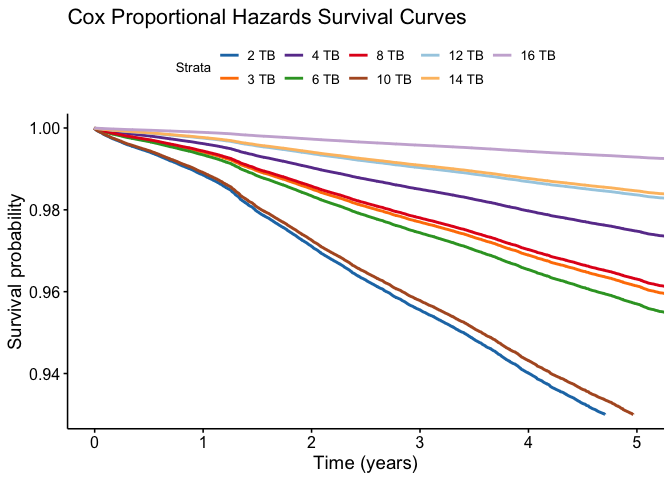

# Data Sources

I’m buying a hard drive for backups, and I want to buy a drive that’s
not going to fail. I’m going to use data from
[BackBlaze](https://www.backblaze.com/b2/hard-drive-test-data.html#downloading-the-raw-hard-drive-test-data)
to assess drive reliability. Backblaze [did their own
analysis](https://www.backblaze.com/blog/backblaze-hard-drive-stats-q1-2020/)
of drive failures, but I don’t like their approach for 2 reasons:  
1. Their “annualized failure rate” `Drive Failures / (Drive Days / 365)`
assumes that failure rates are constant over time. E.g. this assumption
means that observing 1 drive for 100 days gives you the exact same
information as observing 100 drives for 1 day. If drives fail at a
constant rate over time, this is fine, but I suspect that drives
actually fail at a higher rate early in their lives.  
2. I want to compute a confidence interval of some kind, so I can select
a drive that both has a low failure rate, but also enough observations
to make me confident in this failure rate. For example, if I have a
drive that’s been observed for 1 day with 0 failures, I probably don’t
want to buy it, despite it’s zero percent failure rate. [This blog
post](https://www.evanmiller.org/how-not-to-sort-by-average-rating.html)
has some good details on why confidence intervals are useful for sorting
things.

# Results

I chose to order the drives by their expected 5 year survival rate. I
calculated a 95% confidence interval on the 5-year survival rate, and I
used that interval to sort the drives. Based on this analysis, the wdc
wuh721414ale6l4 is the most reliable drive model in our data, with an
estimated 5-year survival rate that is at least 99.69%.

The top 25 drives from this analysis are:

<table>
<colgroup>
<col style="width: 26%" />
<col style="width: 6%" />
<col style="width: 6%" />
<col style="width: 12%" />
<col style="width: 10%" />
<col style="width: 13%" />
<col style="width: 10%" />
<col style="width: 13%" />
</colgroup>
<thead>
<tr class="header">
<th style="text-align: left;">model</th>
<th style="text-align: left;">size</th>
<th style="text-align: right;">N</th>
<th style="text-align: right;">drive_days</th>
<th style="text-align: right;">failures</th>
<th style="text-align: left;">surv_5yr_lo</th>
<th style="text-align: left;">surv_5yr</th>
<th style="text-align: left;">surv_5yr_hi</th>
</tr>
</thead>
<tbody>
<tr class="odd">
<td style="text-align: left;">wdc wuh721414ale6l4</td>
<td style="text-align: left;">14 TB</td>
<td style="text-align: right;">8452</td>
<td style="text-align: right;">5471924</td>
<td style="text-align: right;">43</td>
<td style="text-align: left;">99.69%</td>
<td style="text-align: left;">99.77%</td>
<td style="text-align: left;">99.83%</td>
</tr>
<tr class="even">
<td style="text-align: left;">wdc wuh721816ale6l0</td>
<td style="text-align: left;">16 TB</td>
<td style="text-align: right;">2705</td>
<td style="text-align: right;">956996</td>
<td style="text-align: right;">3</td>
<td style="text-align: left;">99.67%</td>
<td style="text-align: left;">99.89%</td>
<td style="text-align: left;">99.97%</td>
</tr>
<tr class="odd">
<td style="text-align: left;">hgst huh721212ale600</td>
<td style="text-align: left;">12 TB</td>
<td style="text-align: right;">2632</td>
<td style="text-align: right;">2818625</td>
<td style="text-align: right;">25</td>
<td style="text-align: left;">99.63%</td>
<td style="text-align: left;">99.75%</td>
<td style="text-align: left;">99.83%</td>
</tr>
<tr class="even">
<td style="text-align: left;">hgst hms5c4040ale640</td>
<td style="text-align: left;">4 TB</td>
<td style="text-align: right;">8723</td>
<td style="text-align: right;">16461571</td>
<td style="text-align: right;">238</td>
<td style="text-align: left;">99.56%</td>
<td style="text-align: left;">99.62%</td>
<td style="text-align: left;">99.66%</td>
</tr>
<tr class="odd">
<td style="text-align: left;">hgst huh721212aln604</td>
<td style="text-align: left;">12 TB</td>
<td style="text-align: right;">10982</td>
<td style="text-align: right;">13782875</td>
<td style="text-align: right;">191</td>
<td style="text-align: left;">99.55%</td>
<td style="text-align: left;">99.61%</td>
<td style="text-align: left;">99.67%</td>
</tr>
<tr class="even">
<td style="text-align: left;">hgst huh721212ale604</td>
<td style="text-align: left;">12 TB</td>
<td style="text-align: right;">13255</td>
<td style="text-align: right;">7187671</td>
<td style="text-align: right;">94</td>
<td style="text-align: left;">99.50%</td>
<td style="text-align: left;">99.59%</td>
<td style="text-align: left;">99.67%</td>
</tr>
<tr class="odd">
<td style="text-align: left;">hitachi hds5c4040ale630</td>
<td style="text-align: left;">4 TB</td>
<td style="text-align: right;">2719</td>
<td style="text-align: right;">4641113</td>
<td style="text-align: right;">89</td>
<td style="text-align: left;">99.36%</td>
<td style="text-align: left;">99.48%</td>
<td style="text-align: left;">99.58%</td>
</tr>
<tr class="even">
<td style="text-align: left;">hitachi hds5c3030ala630</td>
<td style="text-align: left;">3 TB</td>
<td style="text-align: right;">4664</td>
<td style="text-align: right;">6934573</td>
<td style="text-align: right;">150</td>
<td style="text-align: left;">99.31%</td>
<td style="text-align: left;">99.41%</td>
<td style="text-align: left;">99.50%</td>
</tr>
<tr class="odd">
<td style="text-align: left;">st12000nm001g</td>
<td style="text-align: left;">12 TB</td>
<td style="text-align: right;">12708</td>
<td style="text-align: right;">8422348</td>
<td style="text-align: right;">174</td>
<td style="text-align: left;">99.30%</td>
<td style="text-align: left;">99.39%</td>
<td style="text-align: left;">99.48%</td>
</tr>
<tr class="even">
<td style="text-align: left;">hgst huh728080ale600</td>
<td style="text-align: left;">8 TB</td>
<td style="text-align: right;">1204</td>
<td style="text-align: right;">1899725</td>
<td style="text-align: right;">39</td>
<td style="text-align: left;">99.23%</td>
<td style="text-align: left;">99.44%</td>
<td style="text-align: left;">99.59%</td>
</tr>
<tr class="odd">
<td style="text-align: left;">toshiba mg07aca14ta</td>
<td style="text-align: left;">14 TB</td>
<td style="text-align: right;">38945</td>
<td style="text-align: right;">26789054</td>
<td style="text-align: right;">666</td>
<td style="text-align: left;">99.21%</td>
<td style="text-align: left;">99.27%</td>
<td style="text-align: left;">99.33%</td>
</tr>
<tr class="even">
<td style="text-align: left;">st6000dx000</td>
<td style="text-align: left;">6 TB</td>
<td style="text-align: right;">1939</td>
<td style="text-align: right;">3822551</td>
<td style="text-align: right;">94</td>
<td style="text-align: left;">99.19%</td>
<td style="text-align: left;">99.34%</td>
<td style="text-align: left;">99.46%</td>
</tr>
<tr class="odd">
<td style="text-align: left;">toshiba mg08aca16tey</td>
<td style="text-align: left;">16 TB</td>
<td style="text-align: right;">4275</td>
<td style="text-align: right;">1515204</td>
<td style="text-align: right;">29</td>
<td style="text-align: left;">99.12%</td>
<td style="text-align: left;">99.39%</td>
<td style="text-align: left;">99.58%</td>
</tr>
<tr class="even">
<td style="text-align: left;">wdc wuh721816ale6l4</td>
<td style="text-align: left;">16 TB</td>
<td style="text-align: right;">7205</td>
<td style="text-align: right;">484470</td>
<td style="text-align: right;">7</td>
<td style="text-align: left;">99.09%</td>
<td style="text-align: left;">99.57%</td>
<td style="text-align: left;">99.79%</td>
</tr>
<tr class="odd">
<td style="text-align: left;">st16000nm001g</td>
<td style="text-align: left;">16 TB</td>
<td style="text-align: right;">20612</td>
<td style="text-align: right;">5912833</td>
<td style="text-align: right;">147</td>
<td style="text-align: left;">99.03%</td>
<td style="text-align: left;">99.17%</td>
<td style="text-align: left;">99.30%</td>
</tr>
<tr class="even">
<td style="text-align: left;">st8000dm002</td>
<td style="text-align: left;">8 TB</td>
<td style="text-align: right;">10300</td>
<td style="text-align: right;">21603295</td>
<td style="text-align: right;">731</td>
<td style="text-align: left;">98.99%</td>
<td style="text-align: left;">99.07%</td>
<td style="text-align: left;">99.14%</td>
</tr>
<tr class="odd">
<td style="text-align: left;">st14000nm001g</td>
<td style="text-align: left;">14 TB</td>
<td style="text-align: right;">10929</td>
<td style="text-align: right;">6432853</td>
<td style="text-align: right;">191</td>
<td style="text-align: left;">98.96%</td>
<td style="text-align: left;">99.10%</td>
<td style="text-align: left;">99.22%</td>
</tr>
<tr class="even">
<td style="text-align: left;">st12000nm0008</td>
<td style="text-align: left;">12 TB</td>
<td style="text-align: right;">20607</td>
<td style="text-align: right;">18507805</td>
<td style="text-align: right;">679</td>
<td style="text-align: left;">98.89%</td>
<td style="text-align: left;">98.97%</td>
<td style="text-align: left;">99.05%</td>
</tr>
<tr class="odd">
<td style="text-align: left;">st8000nm0055</td>
<td style="text-align: left;">8 TB</td>
<td style="text-align: right;">15495</td>
<td style="text-align: right;">27632708</td>
<td style="text-align: right;">1100</td>
<td style="text-align: left;">98.84%</td>
<td style="text-align: left;">98.91%</td>
<td style="text-align: left;">98.98%</td>
</tr>
<tr class="even">
<td style="text-align: left;">hitachi hds722020ala330</td>
<td style="text-align: left;">2 TB</td>
<td style="text-align: right;">4774</td>
<td style="text-align: right;">5675646</td>
<td style="text-align: right;">235</td>
<td style="text-align: left;">98.69%</td>
<td style="text-align: left;">98.85%</td>
<td style="text-align: left;">98.99%</td>
</tr>
<tr class="odd">
<td style="text-align: left;">st10000nm0086</td>
<td style="text-align: left;">10 TB</td>
<td style="text-align: right;">1283</td>
<td style="text-align: right;">2206241</td>
<td style="text-align: right;">88</td>
<td style="text-align: left;">98.65%</td>
<td style="text-align: left;">98.91%</td>
<td style="text-align: left;">99.12%</td>
</tr>
<tr class="even">
<td style="text-align: left;">st12000nm0007</td>
<td style="text-align: left;">12 TB</td>
<td style="text-align: right;">38838</td>
<td style="text-align: right;">36171181</td>
<td style="text-align: right;">2008</td>
<td style="text-align: left;">98.36%</td>
<td style="text-align: left;">98.44%</td>
<td style="text-align: left;">98.52%</td>
</tr>
<tr class="odd">
<td style="text-align: left;">st4000dm000</td>
<td style="text-align: left;">4 TB</td>
<td style="text-align: right;">37037</td>
<td style="text-align: right;">72190670</td>
<td style="text-align: right;">4932</td>
<td style="text-align: left;">98.08%</td>
<td style="text-align: left;">98.16%</td>
<td style="text-align: left;">98.24%</td>
</tr>
<tr class="even">
<td style="text-align: left;">toshiba mg08aca16ta</td>
<td style="text-align: left;">16 TB</td>
<td style="text-align: right;">3761</td>
<td style="text-align: right;">300862</td>
<td style="text-align: right;">11</td>
<td style="text-align: left;">98.07%</td>
<td style="text-align: left;">98.93%</td>
<td style="text-align: left;">99.41%</td>
</tr>
<tr class="odd">
<td style="text-align: left;">toshiba mg08aca16te</td>
<td style="text-align: left;">16 TB</td>
<td style="text-align: right;">6030</td>
<td style="text-align: right;">1941750</td>
<td style="text-align: right;">88</td>
<td style="text-align: left;">97.98%</td>
<td style="text-align: left;">98.36%</td>
<td style="text-align: left;">98.67%</td>
</tr>
</tbody>
</table>

-   **model** is the drive model
-   **size** is the size of the drive
-   **N** is the number of unique drives in the analysis
-   **drive\_days** is the total number of days that we’ve observed for
    drives of this model in the sample
-   **failures** is the number of failures observed so far
-   **surv\_5yr\_lo** is the lower bound of the 95% confidence interval
    of the 5-year survival rate
-   **surv\_5yr** is the 5-year survival rate
-   **surv\_5yr\_hi** is the upper bound of the 95% confidence interval
    of the 5-year survival rate

To narrow down the data, we can just look at the best drive by size
(excluding models that have fewer than 1200):

<table>
<colgroup>
<col style="width: 27%" />
<col style="width: 6%" />
<col style="width: 5%" />
<col style="width: 12%" />
<col style="width: 10%" />
<col style="width: 13%" />
<col style="width: 10%" />
<col style="width: 13%" />
</colgroup>
<thead>
<tr class="header">
<th style="text-align: left;">model</th>
<th style="text-align: left;">size</th>
<th style="text-align: right;">N</th>
<th style="text-align: right;">drive_days</th>
<th style="text-align: right;">failures</th>
<th style="text-align: left;">surv_5yr_lo</th>
<th style="text-align: left;">surv_5yr</th>
<th style="text-align: left;">surv_5yr_hi</th>
</tr>
</thead>
<tbody>
<tr class="odd">
<td style="text-align: left;">wdc wuh721414ale6l4</td>
<td style="text-align: left;">14 TB</td>
<td style="text-align: right;">8452</td>
<td style="text-align: right;">5471924</td>
<td style="text-align: right;">43</td>
<td style="text-align: left;">99.69%</td>
<td style="text-align: left;">99.77%</td>
<td style="text-align: left;">99.83%</td>
</tr>
<tr class="even">
<td style="text-align: left;">wdc wuh721816ale6l0</td>
<td style="text-align: left;">16 TB</td>
<td style="text-align: right;">2705</td>
<td style="text-align: right;">956996</td>
<td style="text-align: right;">3</td>
<td style="text-align: left;">99.67%</td>
<td style="text-align: left;">99.89%</td>
<td style="text-align: left;">99.97%</td>
</tr>
<tr class="odd">
<td style="text-align: left;">hgst huh721212ale600</td>
<td style="text-align: left;">12 TB</td>
<td style="text-align: right;">2632</td>
<td style="text-align: right;">2818625</td>
<td style="text-align: right;">25</td>
<td style="text-align: left;">99.63%</td>
<td style="text-align: left;">99.75%</td>
<td style="text-align: left;">99.83%</td>
</tr>
<tr class="even">
<td style="text-align: left;">hgst hms5c4040ale640</td>
<td style="text-align: left;">4 TB</td>
<td style="text-align: right;">8723</td>
<td style="text-align: right;">16461571</td>
<td style="text-align: right;">238</td>
<td style="text-align: left;">99.56%</td>
<td style="text-align: left;">99.62%</td>
<td style="text-align: left;">99.66%</td>
</tr>
<tr class="odd">
<td style="text-align: left;">hitachi hds5c3030ala630</td>
<td style="text-align: left;">3 TB</td>
<td style="text-align: right;">4664</td>
<td style="text-align: right;">6934573</td>
<td style="text-align: right;">150</td>
<td style="text-align: left;">99.31%</td>
<td style="text-align: left;">99.41%</td>
<td style="text-align: left;">99.50%</td>
</tr>
<tr class="even">
<td style="text-align: left;">hgst huh728080ale600</td>
<td style="text-align: left;">8 TB</td>
<td style="text-align: right;">1204</td>
<td style="text-align: right;">1899725</td>
<td style="text-align: right;">39</td>
<td style="text-align: left;">99.23%</td>
<td style="text-align: left;">99.44%</td>
<td style="text-align: left;">99.59%</td>
</tr>
<tr class="odd">
<td style="text-align: left;">st6000dx000</td>
<td style="text-align: left;">6 TB</td>
<td style="text-align: right;">1939</td>
<td style="text-align: right;">3822551</td>
<td style="text-align: right;">94</td>
<td style="text-align: left;">99.19%</td>
<td style="text-align: left;">99.34%</td>
<td style="text-align: left;">99.46%</td>
</tr>
<tr class="even">
<td style="text-align: left;">hitachi hds722020ala330</td>
<td style="text-align: left;">2 TB</td>
<td style="text-align: right;">4774</td>
<td style="text-align: right;">5675646</td>
<td style="text-align: right;">235</td>
<td style="text-align: left;">98.69%</td>
<td style="text-align: left;">98.85%</td>
<td style="text-align: left;">98.99%</td>
</tr>
<tr class="odd">
<td style="text-align: left;">st10000nm0086</td>
<td style="text-align: left;">10 TB</td>
<td style="text-align: right;">1283</td>
<td style="text-align: right;">2206241</td>
<td style="text-align: right;">88</td>
<td style="text-align: left;">98.65%</td>
<td style="text-align: left;">98.91%</td>
<td style="text-align: left;">99.12%</td>
</tr>
</tbody>
</table>

All of these drives have a very high 5-year survival rate, and I’d feel
pretty confident buying any of them.

# Technical Details

Survival analysis is a little weird, because you don’t observe the full
distribution of your data. This makes some traditional statistics
impossible to calculate. For example, until you observe every hard drive
in the sample fail, you can’t know the mean time to failure. (If you
have one drive left that hasn’t failed yet, and becomes an outlier in
survival time, that might have a big impact on mean survival time.)

Here’s the thing: these drives are **so reliable**, that even after 5+
years of observation, we’ve barely observed the distribution of
failures! (This is a good thing, but it makes it hard to chose between
drives!).

I fit a [Cox Proportional Hazard
model](https://en.wikipedia.org/wiki/Proportional_hazards_model) to this
data, which enabled me to estimate 5 years survival rates for all of the
drives, as well as a confidence interval on that rate. The confidence
interval narrows as you observe more drives and as you observe those
drives for a longer time.

The Cox model is semi-parametric. It assumes a non-parametric, baseline
hazard rate that is the same for all drives. It then fits a single
parameter for each drive that is a multiple on that baseline hazard
rate. So every drive has the same “shape” for its survival curve, but
multiplied by a fixed coefficient per model that makes that “shape”
steeper or shallower.

# Plots

Here is a plot of the survival for each of the best drive models. Each
curve ends with the oldest drive we’ve observed (these are called
[Kaplan–Meier](https://en.wikipedia.org/wiki/Kaplan%E2%80%93Meier_estimator)
curves):

Note that we haven’t even observed 1 year’s worth of data yet for the 14
and 16TB drives, but they seem to have a very low failure rate relative
to the other drives during their first year of life.

The “proportional hazards” assumption from the Cox model allows us to
extend these curves and estimate survival times at 5 years for all of
the drives:

This plot doesn’t have the confidence intervals, which are wider for the
drives with less data.

# Replicating my results

[drive\_dates.csv](results/drive_dates.csv) has the cleaned up data from
backblaze, with each drive, its model, when it was installed, when it
failed (NA for drives that have not failed) and when it was last
observed.

[README.Rmd](README.Rmd) has the code to run this analysis and generate
this [README.md](README.md) file you are reading right now. Use
[RStudio](https://rstudio.com/products/rstudio/download/) to `knit` the
`Rmd` file into a `md` file, which github will then render nicely for
you.

If you want to get the raw data before it was cleaned up into
[all\_data.csv](results/all_data.csv), you’ll need at least 70GB of free
hard drive space. I also suggest opening
[backblaze\_analysis.Rproj](backblaze_analysis.Rproj) in RStudio.  
1. Run [1\_download\_data.R](code/1_download_data.R) to download the
data (almost 10.5 GB).  
2. Run [2\_unzip\_data.R](code/2_unzip_data.R) to unzip the data (almost
55 GB).  
3. Run [3\_assemble\_data.R](code/3_assemble_data.R) to “compress” the
data, which generates [all\_data.csv](all_data.csv).  
4. Run [4\_survival\_analysis.R](code/4_survival_analysis.R) to
calculate 5 year survival.

An interesting note about this data: It’s 55GB uncompressed, and
contains a whole bunch of irrelevant information. It was very
interesting to me that I could compress a 55GB dataset to NA Mb, while
still keeping **all** of the relevant information for modeling. (In
other words, this dataset was 4,000x larger than it needed to be). I
think this is another example of how good data structures are essential
for data science is.

# Erratum

I’m probably way over-thinking this, but it was fun to analyze the data.
Any of the top 25 drives are likely safe to buy, and are very unlikely
to fail.

There are some drives in this data I plan to avoid. For example, the
st3000dm001 has a 5 year survival of 80.6%. This is honestly probably
fine for my purposes, but maybe I’d be a little nervous to buy a drive
with a 1-in-5 chance of dying within 5 years.

